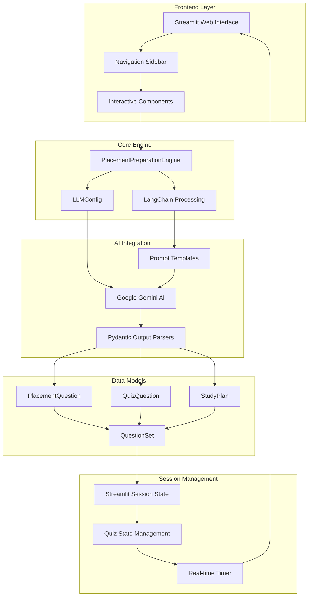

# 🎯 Placement Prep Pro

## Overview
Placement Prep Pro is an AI-powered application designed to help students prepare for technical placement interviews at top-tier companies. The system generates company-specific questions, personalized study plans, and interactive time-based quizzes using Google's Gemini AI.

## Live Demo
👉 [Check out the live app here](https://placement-prep-aerol8prrfndlqzfwnzztt.streamlit.app/)

## 🏗️ System Architecture



## 🌟 Key Features

### 1. 🎯 Practice Questions Generator
- **Company-specific questions** for Tier 1 (FAANG) and Tier 2 companies
- **Topic-focused preparation** covering DSA, System Design, OOP, etc.
- **Detailed solutions** with code examples and explanations
- **Follow-up questions** to simulate real interview scenarios

### 2. 📚 Personalized Study Plans
- **Customized timelines** (1-6 months preparation)
- **Daily schedules** with 6-8 hour study breakdowns
- **Week-wise goals** and milestones
- **Resource recommendations** and mock interview schedules

### 3. 🧠 Time-Based Quiz System
- **Real-time timer** with auto-submission
- **Difficulty-based time limits** (Easy: 45s, Medium: 60s, Hard: 90s)
- **Intelligent scoring** with time bonuses
- **Detailed performance analysis** and explanations

## 🔧 Technical Architecture

### Core Components

#### 1. **LLMConfig Class**
```python
# Manages AI model configuration
- API key management
- Model parameters (temperature, max_tokens)
- Custom model support
```

#### 2. **Data Models (Pydantic)**
```python
# Structured data validation and parsing
- PlacementQuestion: Interview questions with solutions
- QuizQuestion: MCQ with timing and explanations  
- StudyPlan: Comprehensive preparation roadmap
- QuestionSet: Collection of related questions
```

#### 3. **PlacementPreparationEngine**
```python
# Main processing engine
- LLM initialization and management
- Prompt template processing
- Response parsing and validation
- Error handling and fallbacks
```

#### 4. **Session State Management**
```python
# Real-time quiz functionality
- Question progression tracking
- Timer management
- Score calculation
- Performance analytics
```

### Data Flow

1. **User Input** → Streamlit interface captures user preferences
2. **Configuration** → LLMConfig sets up AI model parameters
3. **Prompt Generation** → LangChain creates structured prompts
4. **AI Processing** → Google Gemini generates content
5. **Data Parsing** → Pydantic validates and structures responses
6. **State Management** → Streamlit session state handles real-time interactions
7. **UI Rendering** → Dynamic content display with interactive elements

## 🚀 Installation & Setup

### Prerequisites
```bash
- Python 3.8+
- Google AI API Key
- Required packages (see requirements below)
```

### Dependencies
```python
streamlit
pydantic
langchain-google-genai
langchain
python-dotenv
```

### Environment Setup
```bash
# 1. Clone the repository
git clone <repository-url>
cd placement-prep-pro

# 2. Install dependencies
pip install -r requirements.txt

# 3. Set up environment variables
echo "GOOGLE_API_KEY=your_api_key_here" > .env

# 4. Run the application
streamlit run app.py
```

## 📊 Usage Guide

### 1. Practice Questions Mode
- Select company tier (Tier 1/Tier 2)
- Choose company type (Product/Service/Fintech/etc.)
- Pick technical topic
- Generate 3-15 questions with detailed solutions

### 2. Study Plan Mode
- Set target company tier
- Choose preparation duration
- Select focus areas
- Get personalized week-wise study plan

### 3. Quiz Mode
- Select topic and difficulty
- Configure number of questions (5-20)
- Take timed quiz with real-time feedback
- Review detailed performance analysis

## 🎯 Company Classifications

### Tier 1 Companies (Premium-Based Companies)
- **FAANG**: Google, Meta, Amazon, Netflix, Apple
- **Tech Giants**: Microsoft, Adobe, Salesforce, Oracle
- **Unicorns**: Uber, Airbnb, LinkedIn, Palantir

### Tier 2 Companies (Service-Based Companies)
- **Consulting**: Accenture, Deloitte, PwC, KPMG
- **Indian IT**: TCS, Infosys, Wipro, HCL, Cognizant
- **Product**: Flipkart, Paytm, Zomato, PhonePe

## 🔍 Technical Topics Covered

- Data Structures & Algorithms
- System Design
- Object-Oriented Programming
- Database Management
- Operating Systems
- Computer Networks
- Web Development
- Machine Learning
- Cloud Computing
- Cybersecurity

## 📈 Performance Metrics

### Quiz Scoring System
- **Base Score**: 10 points per correct answer
- **Time Bonus**: Up to 5 points based on speed
- **Maximum**: 15 points per question

### Performance Categories
- **🌟 Excellent**: 80%+ score (12+ points average)
- **👍 Good**: 60-79% score (9-11 points average)
- **📚 Needs Practice**: 40-59% score (6-8 points average)
- **💪 Keep Studying**: <40% score (<6 points average)

## 🎨 User Interface Features

### Interactive Elements
- **Progress Bars**: Real-time quiz progression
- **Dynamic Timers**: Countdown with color coding
- **Expandable Sections**: Organized question display
- **Multi-column Layouts**: Efficient space utilization
- **Session Persistence**: Maintains state across interactions

### Visual Feedback
- **Color-coded Results**: Green for correct, red for incorrect
- **Performance Metrics**: Cards showing key statistics
- **Balloons Animation**: Celebration on quiz completion
- **Warning Alerts**: Time-based notifications

## 🔒 Error Handling

### Robust Exception Management
- **API Failures**: Graceful fallbacks with empty models
- **Parsing Errors**: User-friendly error messages
- **Timeout Handling**: Auto-submission for quiz questions
- **State Recovery**: Session state preservation

### User Experience Safeguards
- **Input Validation**: Prevents invalid configurations
- **Loading Indicators**: Shows processing status
- **Retry Mechanisms**: Handles temporary failures
- **Clear Instructions**: Guides user through features

## 🚀 Future Enhancements

### Planned Features
- **Interview Simulation**: Voice-based mock interviews
- **Progress Tracking**: Long-term performance analytics
- **Custom Topics**: User-defined question categories
- **Export Functionality**: PDF reports and study materials

### Technical Improvements
- **Caching Layer**: Reduced API calls and faster responses
- **Database Integration**: Persistent user data
- **Multi-language Support**: Regional language options
- **Mobile Optimization**: Responsive design improvements


**Made with ❤️ by Zoya for aspiring software engineers**

*Empowering students to crack their dream placements through AI-powered preparation*
